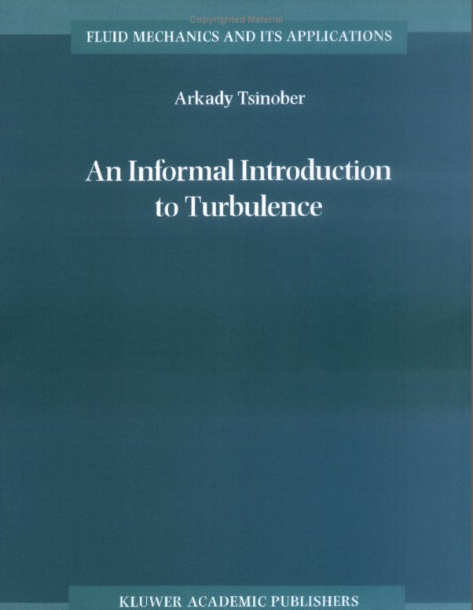
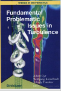

## Books and book sections

### A. Liberzon

[Link to the book on Google books](http://books.google.co.il/books?id=ltmr9R7JzLMC&pg=PA271&dq=liberzon&lr=&as_brr=3&ei=XaDZR_fTI5KatAOeovD3AQ&rview=1&sig=vty7Jvmi8JKbISoK-VWpZYJqYwg&redir_esc=y)

[Link to the book][http://link.springer.com/book/10.1007/978-3-540-32603-8/page/1] 

### A. Tsinober

#### An informal introduction to turbulence

[Link to the book](http://www.springer.com/physics/mechanics/book/978-1-4020-0166-6)

The above monograph was published by Kljuwer (now [at Springer][6]) in November 2001. A list of **corrections** to the first printing of the book is available in pdf format and in postscript. Suggestions and critisisms are very welcomed at tsinober@eng.tau.ac.il 

---

New Approaches and Concepts in Turbulence
Series: Monte Verita  
Dracos, T.; **Tsinober, A.** (Eds.)  
1993, Hardcover  
ISBN: 978-3-7643-2924-2  
A Birkhauser book 

[Link to the book](http://www.springer.com/birkhauser/mathematics/book/978-3-7643-2924-2)

***

Topological Fluid Mechanics: Proceedings of the IUTAM Symposium, Cambridge, UK, 13-18 August, 1989, Edited by K. Moffatt and A. Tsinober

[Link to the book][13] 
 
[13]: http://www.amazon.com/Topological-Fluid-Mechanics-Proceedings-Symposium/dp/0521381452

***

[Progress in Turbulence](http://books.google.com/books?id=CZEreDEoXXEC&pg=PA36&vq=tsinober&rview=1&source=gbs_search_r&cad=0_2&sig=vFqQ2QeJw3SmjjP-VOajEPtrC1o#PPA31,M1) 

 
 

