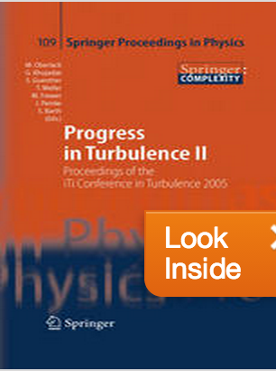
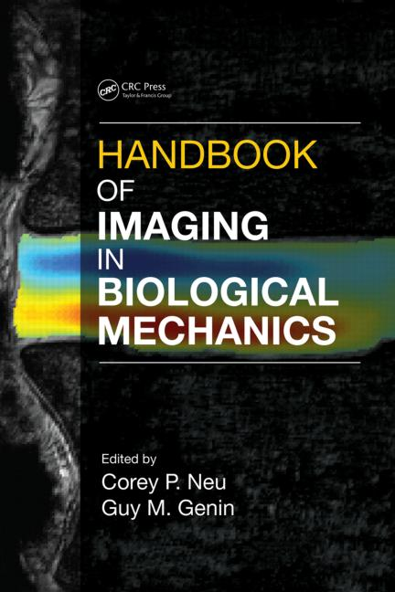

### Chapters in books

[Link to the book on Google books](http://books.google.co.il/books?id=ltmr9R7JzLMC&pg=PA271&dq=liberzon&lr=&as_brr=3&ei=XaDZR_fTI5KatAOeovD3AQ&rview=1&sig=vty7Jvmi8JKbISoK-VWpZYJqYwg&redir_esc=y)

[Link to the book](http://link.springer.com/book/10.1007/978-3-540-32603-8/page/1) 

[Particle Image Velocimetry for Biological Mechanics; Zachary J. Taylor, Roi Gurka, and Alex Liberzon](https://www.crcpress.com/Handbook-of-Imaging-in-Biological-Mechanics/Neu-Genin/9781466588134) 

 
 

