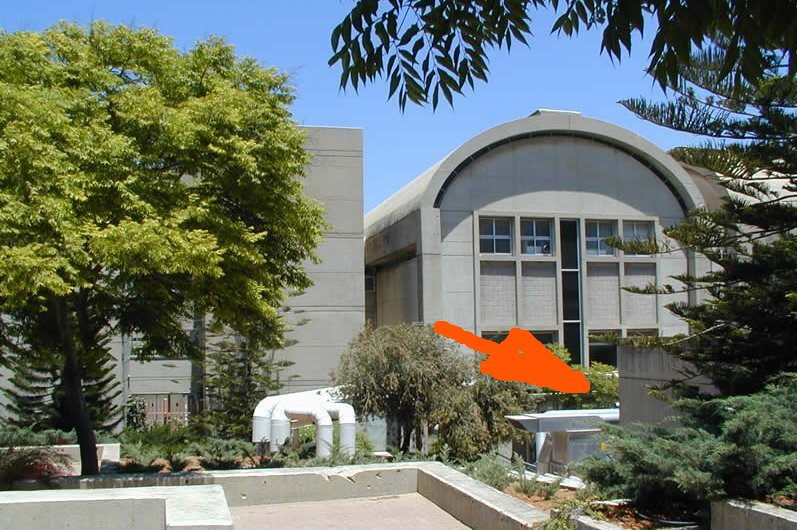
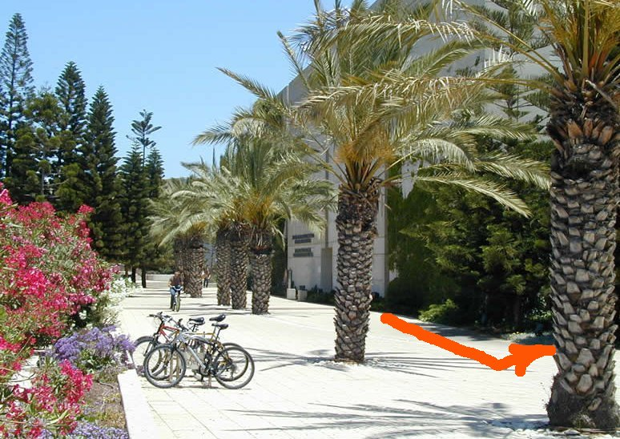
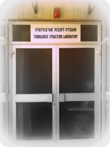

### Contact
* Tel/Fax: +972-3-640-6860  
* Office: +972-3-640-8928

### How to find us

Our lab is located in a **small building between** the Wolfson building of
the Faculty of Engineering and the Computer Sciences building, next to the Mechanical Wokshop and 
the new auditorium no. 020

### Find Tel Aviv University

### Find the Faculty of Engineering on the [university map](http://www2.tau.ac.il/map/unimaple1.asp)

[PDF map]({{site.baseurl}}/files/taumap.pdf)

Find your way to the laboratory, walking East between the Wolfson building of the Faculty of Engineering and the Student classes building (“בניין כיתות”). You can ask about the way to the new students' auditorium no. 020 or to the mechanical workshop. You'll find the lab under the red light (don't enter if it's on) and the sign **Turbulence Structure Laboratory** as it is shown below.

### Some visual information:

### From the train station to the office

The walking map: [Walking map by Google maps](http://goo.gl/maps/juOAE)

From the train station take the exit towards the University (left side). When you exit, you get into the bus station:

1. if you want to walk, the instructions are attached, it will take approximately 10 minutes. Just keep walking straight as you exit the train station and you'll reach the stairs on your right - walk up and follow the road straight up. After 50 m cross the street to the left and follow the stairs again to the parking around the university. Cross the parking and enter the university through the gate 16 (take some ID to show the security). Enter the gate and walk just straight, the third building on your right is the gray building - this is the Wolfson Building of Mechanical Engineering.

Enter the building at the main entrance (you'll be on your right as you pass half of the building) and follow the stairs to the 3rd floor, my office is on the right, office room 316. 

 
2. if you use the bus, Bus 7 or 45 (Dan) take you to Engineering, gate no. 14 - it's just one stop. If you enter the gate no. 14, our building is on the left, the security will show you. 

Don't hesitate to call to the lab or office (sometimes we have difficulties to get calls inside the building, you'll find it easier next to the windows) 03-6408928

