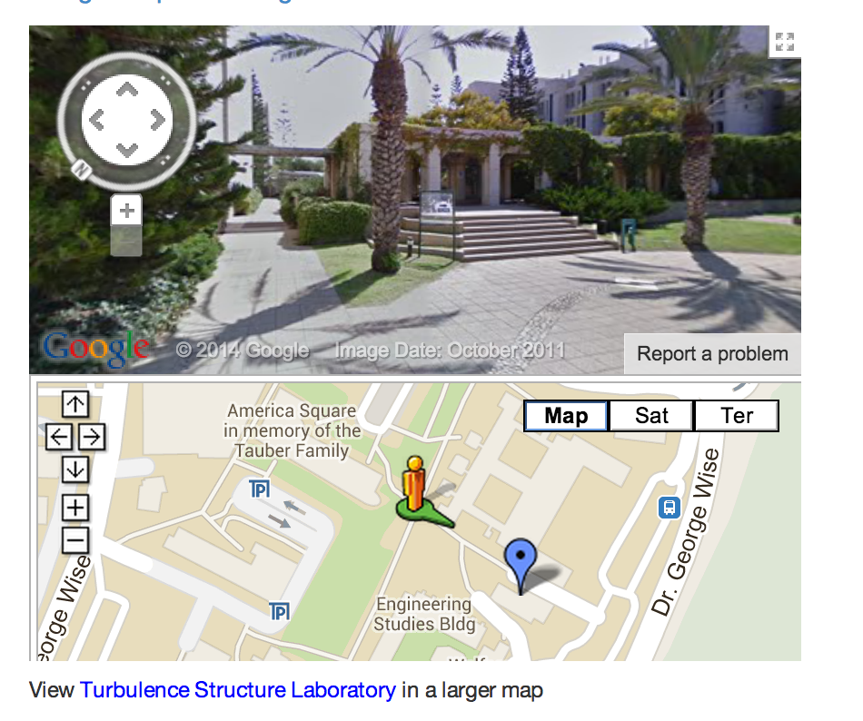

### Follow this Google map 

[Google Map and Google street view of the lab](http://goo.gl/maps/0pxLH)  

<html>
<iframe width="425" height="350" frameborder="0" scrolling="no" marginheight="0" marginwidth="0" src="https://maps.google.com/maps/ms?msa=0&amp;msid=207169972588554588833.0004e8a4641a94b78b300&amp;ie=UTF8&amp;ll=32.110161,34.805692&amp;spn=0,0&amp;t=m&amp;layer=c&amp;cbll=32.109302,34.806552&amp;panoid=4NFsvuAqSR6sGmrOJN0XsQ&amp;cbp=12,275.2,,0,13.64&amp;source=embed&amp;output=svembed"></iframe> <small>View <a href="https://maps.google.com/maps/ms?msa=0&amp;msid=207169972588554588833.0004e8a4641a94b78b300&amp;ie=UTF8&amp;ll=32.110161,34.805692&amp;spn=0,0&amp;t=m&amp;layer=c&amp;cbll=32.109302,34.806552&amp;panoid=4NFsvuAqSR6sGmrOJN0XsQ&amp;cbp=12,275.2,,0,13.64&amp;source=embed" style="color:#0000FF;text-align:left">Alex Liberzon Laboratory</a> in a larger map</small>
</html>

### View from the University side 

### Walking from the train station

[Walking path from the train station](http://goo.gl/maps/lcNq6)

