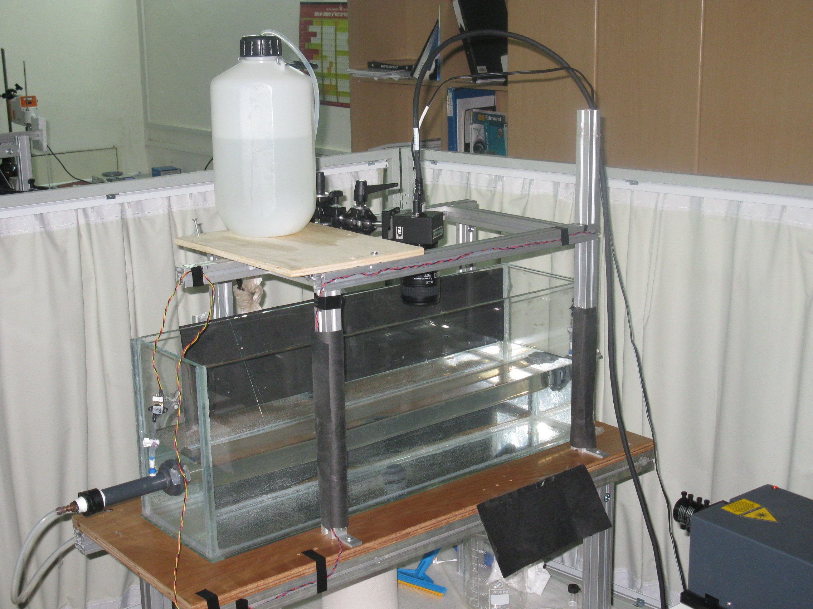
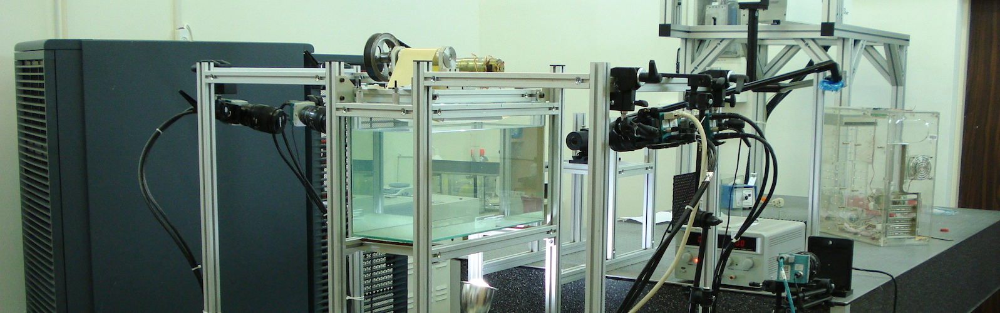
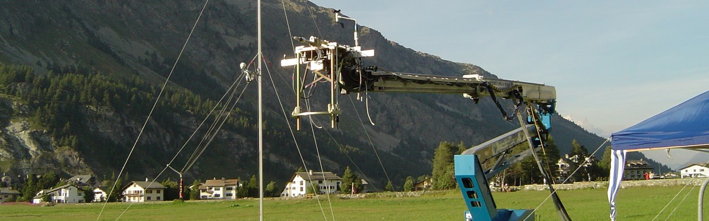
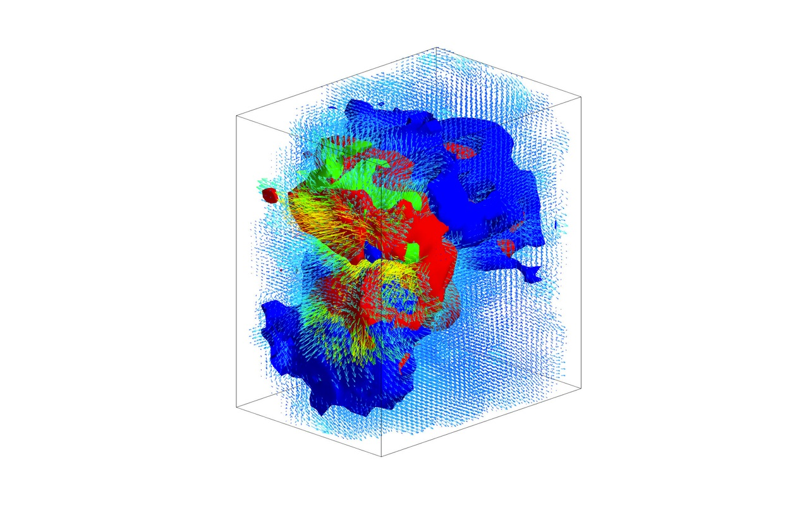

## Welcome to the Turbulence Structure Laboratory website

Turbulence Structure Laboratory is a research laboratory at the School of Mechanical Engineering, Tel Aviv University, studying the structure of turbulent flows. 

### Turbulence

>  Turbulence it is a disordered motion of fluid that has enormous practical importance. We believe that detailed experiments, jointly performed with the numerical simulations and leaded by the theoretical predictions will help us gaining better insight into the structure of turbulence. 

We develop unique technologies such as **multi-hot-cold-wire anemometers** and **3D particle tracking velocimetry** and implement those to the study the *structure of turbulence*. We are working on the novel methods to cope with the smallest, sub-Kolmogorov, scales of turbulent flows. Read more on the [Research](research/index.html).  

###  Open positions

We are looking for the Ph.D. candidates and postdocs for the following topics: [Open positions](openpositions.html)

### News: (see more on our [blog](blog.html))

* **דרוש/ה סטודנט/ית לתואר שני או שלישי** [Open positions](openpositions.html)   
* We got "Kamin" fund, in collaboration with the Technion and BGU to develop the flexible-blade in-line rheometer, read about our [Patents](research/patents.html)
* [Hadar Ben Gida](people/hadar_ben_gida.html) passed his M.Sc. seminar, congratulations. 
* Congratulations to [Hadar Traugott](people/hadar_traugott.html) who has won the "Outstanding presentation" award at Israel Mechanical Engineering Society 2012 symposium. 
* Congratulations to [Hadar Traugott](people/hadar_traugott.html) for the Excellence in Studies Award of the Graduate School of the Faculty of Engineering
* Congratulations to [Hadar Ben Gida](people/hadar_ben_gida.html) for receiving the The Rinna Bolle Student Travel Fund of Tel Aviv University

### Image gallery 

### Video gallery
Visit also our video gallery [Video](videogallery.html)

	
### How to find us:
[How to find the laboratory](howtofindus.html)

### Undergraduate projects

We offer few undergraduate projects for the Mechanical, Biomedical or Electrical Engineering students. Some examples are listed on the [Undergraduate projects](undergraduate_projects.html) page. 

### Additional info:
* See example notes of our new *Advanced Measurement Methods in Fluid Dynamics and Heat Transfer* [Courses](/courses). 
* Faculty of Engineering 2008 journal (בטאון הפקולטה ל 2008) devoted a page to our laboratory (in Hebrew): [PDF](/files/Pagesfrom2008bitaon.pdf)
* Faculty of Engineering 2010 highlights (בטאון הפקולטה ל 2010) devoted a page to our laboratory (in Hebrew): [PDF](/files/Pagesfrom2010bitaon.pdf)
* Laser safety forms: [PDF](files/laser_safety.pdf)

[11]: http://www.sciencedirect.com/science/article/pii/S0894177712000118
[12]: http://dx.doi.org/10.1016/j.ijheatfluidflow.2011.08.005
[13]: http://www.springerlink.com/content/?Author=Alex+Liberzon