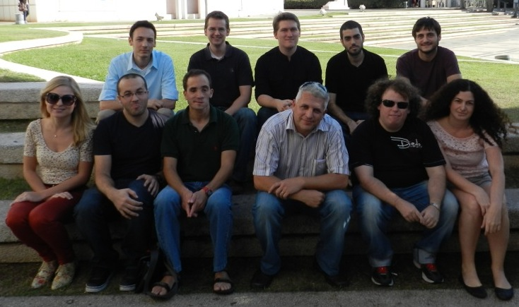

 

November 2012. Left to right: 
Top row: Mark Baevsky, Zachary Taylor, Lon Cherryholmes, Avi Friedman, Alon Sussmann.
Bottom row: Katya Talmor, Erez Wenger, Yosef Meller, Alex Liberzon, Hadar Biran, Hadar Traugott
Missing: Hadar Ben Gida, Youry Borisenkov, Dina Bass

### Faculty

* [Alex Liberzon](people/alex_lab.html), Head (Associate Prof.)

### Lab Engineer
* Gregory Gulitski, Ph.D.

### Ph.D. students
* [Yosef Meller](people/yosef_meller.html)
* [Lilly Verso](people/lilly_verso.html)

### M.Sc. students
* [Ron Shnapp](people/ron_shnapp.html)
* [Yoav Kessler](people/yoav_kessler.html), co-supervised with Prof. Slava Krylov
* [Barak Even Chen](people/barak_even_chen.html), co-supervised with Prof. Idit Avrahami
* [Shirly Steinlauf](people/shirly_steinlauf.html), co-supervised with Prof. Idit Avrahami
* [Shaily Wald](people/shaily_wald.html), co-supervised with Prof. Idit Avrahami
* [Nimrod Daniel](people/nimrod_daniel.html)
* [Oz Habiby](people/oz_habiby.html)

### Undergraduates and visitors
* [Lisa Yang](people/lisa_yang.html), [MIT-Israel program](http://misti.mit.edu/mit-israel)
* [Sarah Berdugo](people/sarah_berdugo.html), Pierre et Marie Curie University, Paris
* [Sabrina Shlain](people/sabrina_shlain.html), Tel Aviv University

### Alumni
* Ephi Ezri, M.Sc. Graduated 2008
* [Assaf Barel](http://il.linkedin.com/pub/assaf-barel/7/364/686), M.Sc. Graduated 2008
* Eduard Patlakh, M.Sc. Graduated 2008 [backup](people/eduard_patlakh.html)
* [Michael Degtyar](http://il.linkedin.com/in/michaeldegtyar), B.Sc. Graduated 2009 [backup](people/michael_degtyar.html)
* [Maya Beckerman](people/maya_beckerman.html), B.Sc. Graduated 2010
* Danny Sorkin, B.Sc. Graduated 2010
* [Roman Povolotsky](http://il.linkedin.com/pub/roman-povolotsky/19/442/782), B.Sc. Graduated 2010 [backup](people/roman_povolotsky.html)	
* [Eldad Sumnon](people/eldad_sumnon.html), B.Sc. Graduated 2009
* [Reut Elfassi](http://au.linkedin.com/pub/reut-elfassi/20/3b6/397), M.Sc. Graduated Jan. 2010 [backup](people/reut_elfassi.html)
* [David Ratner](http://il.linkedin.com/pub/david-ratner/4/a98/140), M.Sc. Graduated Nov. 2010 [backup](people/david_ratner.html)
* [Mark Kreizer](http://il.linkedin.com/pub/mark-kreizer/9/36/464), M.Sc. Graduated Feb. 2011 [backup](people/mark_kreizer.html)
* [Tracey Hayse](http://www.linkedin.com/in/traceyhayse), MITSI program, 2011 [backup](people/tracey.html)
* [Tyler Mehrman](http://zetapsi.mit.edu/brothers/11/), MISTI program, 2012
* [Dikla Kersh](http://il.linkedin.com/pub/dikla-kersh/14/85b/27), M.Sc. Graduated Nov. 2012 [backup](people/dikla_kersh.html)
* [Lon T. Cherryholmes](people/lon.html), B.Sc., graduated 2013
* [Katya Talmor](people/katya_talmor.html), B.Sc., graduated 2013
* [Alon Sussmann](people/alon_sussmann.html), now at his final year project
* [Dina Bass](people/dina_bass.html), Graduated B.Sc. Biomedical Engineering, Sep. 2013
* [Zachary Taylor, Ph.D.](people/zach.html), ex-post-doc, Wind Energy Research Center, Canada
* [Erez Wenger](people/erez_wenger.html), changed his topic to Solar Energy, September 2013
* [Hadar Ben Gida](people/hadar_ben_gida.html), co-supervised with Dr. Roi Gurka, graduated May 2013
* [Yitzchak Shuman](people/yitzchak_shuman.html), co-supervised with Prof. Slava Krylov
* [Shlomo Markman](people/shlomo_markman.html)
* [David Altura](people/david_altura.html), co-supervised with Prof. Neima Brauner
* [Hadar Traugott](people/hadar_traugott.html), [Dead Sea Works](http://en.wikipedia.org/wiki/Dead_Sea_Works) 
* [Alexander Hinterberger](people/alexander_hinterberger.html), Vienna Technical University, Austria. 
* [Barak Glassman](people/barak_glassman.html)
* [Avi Friedman](people/avi_friedman.html), co-supervised with Dr. Gabor Kosa
* [Mark Baevsky](people/mark_baevsky.html)
* [Hadar Biran](people/hadar_biran.html), co-supervised with Dr. Idit Avrahami

