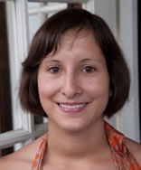
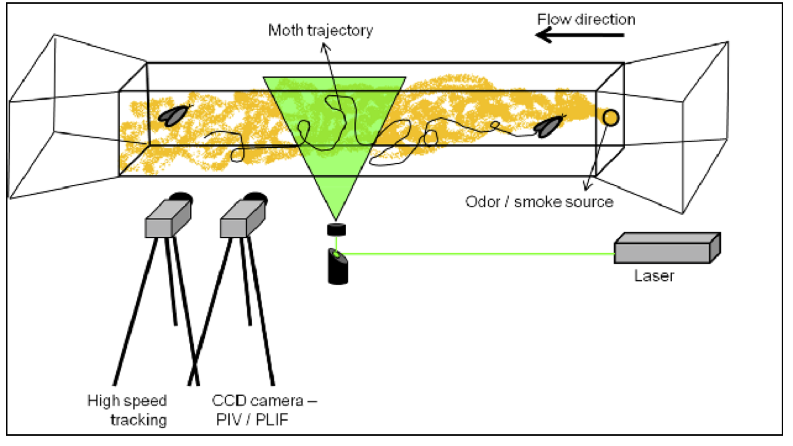

<html>

</html>

Adrea joined our multi-disciplinary research project with Prof. Ally Harari from the Volcani center
and Prof. Roi Gurka from the Coastal Carolina University after the Ph.D. at UCLA https://www.eeb.ucla.edu/Faculty/Grether/pages/gradstudents/adrea.php?menu=2

Adrea is working with moths, studying their navigation based on olfactory search.

