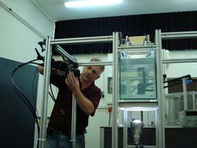

* Professional website: [Alex Liberzon](http://www.eng.tau.ac.il/~alexlib)
* Personal blog: [Phanta Rhei - everything flows](http://alexl.wordpress.com)

<html>

</html>

Alex has joined the Alex Liberzon Laboratory since 2006, after his postdoctoral
period at ETH Zurich. Alex graduated from the Mechanical Engineering at the Technion, Haifa in 2003. 
The research interests are related to experimental fluid dynamics, with the special focus on 
turbulent flows. More specifically, the major gole is to understand the changes of turbulence
structure in the flows with external influences or additives, e.g. stratification, two-phase particle-laden
flows, dilute polymers, etc. In addition, Alex's research involves an open source software development and some 
research related to the movement of bio-organisms in turbulent flow conditions. 
