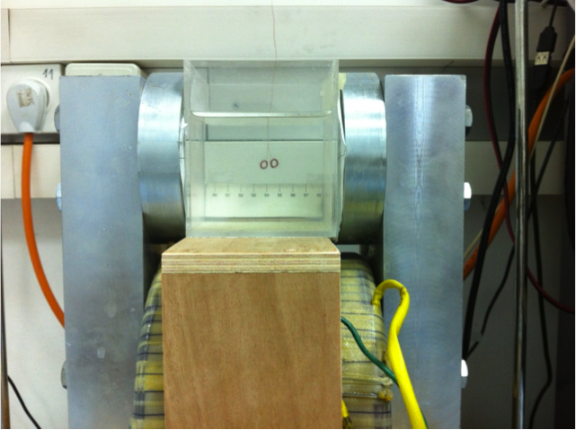

<html>

</html>

My work is Investigating the flow around a micro-swimmer utilizing MRI fields for undulatory locomotion in in-vivo applications. Such micro-robotic swimmers have great potential in the biomedical field (Nelson et al. 2010). These, particularly the untethered robotic devices, are micro-devices scaled at 10 µm – 1 mm in size, which can be used in in-vivo procedures in an accurate and targeted way. 
Different kinds of methods are developed to propel such micro-devices in an aquatic environment. This specific device is aimed in the future to be inductively powered using the RF coils of an MRI machine (Kosa et al. 2008).
This work is co-advised by Gabor Kosa from the Robots and BioMedical MicroSystems (RBM2S) Laboratory

