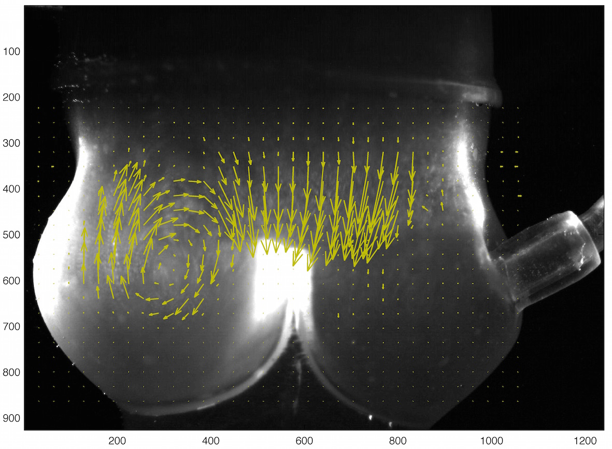

Barak Even Chen is our M.Sc. student, supervised jointly with Prof. Idit Avrahami from Ariel University. Barak's research project is an experimental study of the effect of valve replacements on coronary flows. The numerical side of this project is solving Shaily Wald, also a jointly-supervised M.Sc. student. 

