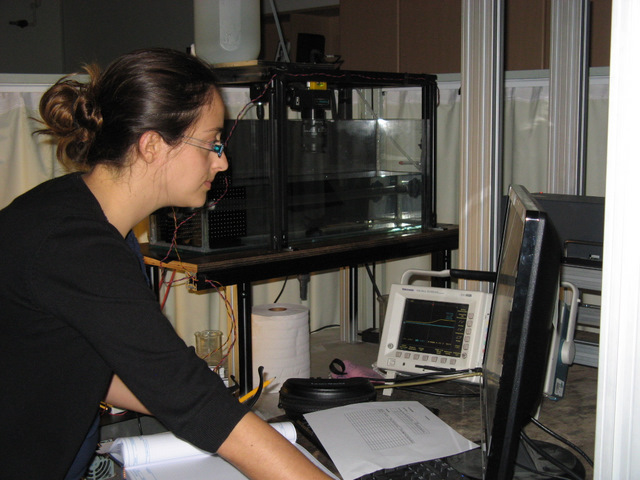
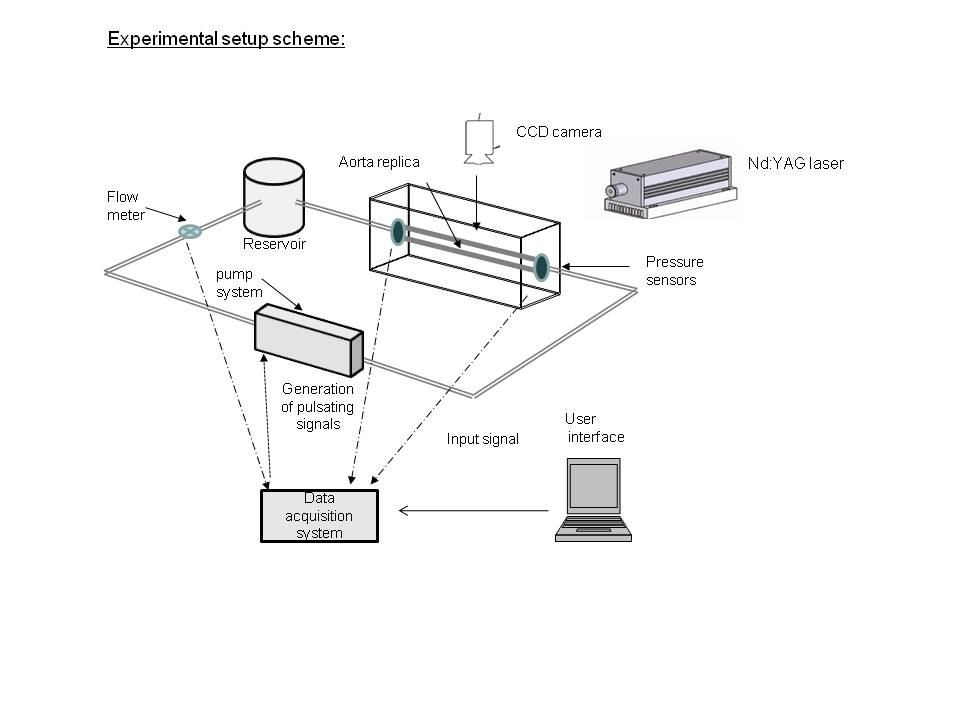
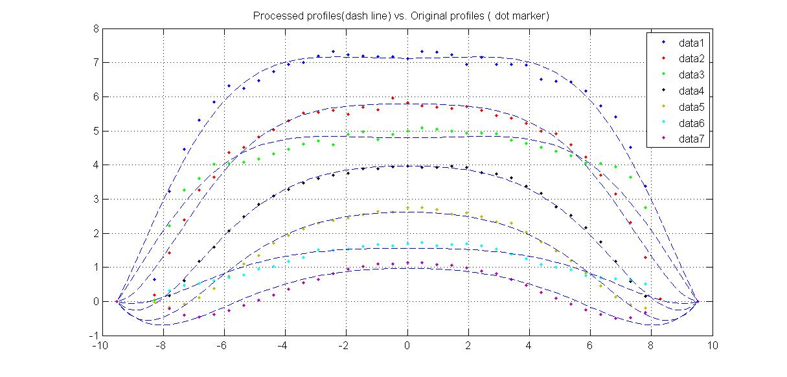

My bio on [LinkedIn](http://il.linkedin.com/pub/dikla-kersh/14/85b/27)

### Research topic

Pulsating flow in an elastic tube - [M.Sc. Thesis in PDF format](https://www.box.com/s/b36a307a346ed09ffeae)

### Labview control of a pulsating signal

### Preliminary results

