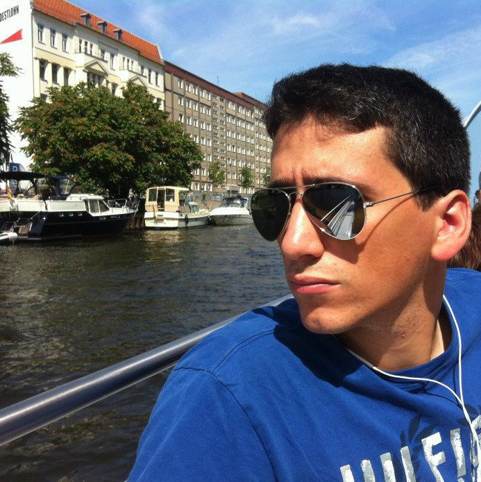

Hadar research is on the turbulent patch evolution in stratified environment. The questions related to secondary instability at long times, variation of coherent motions in the turbulent wake due to the interaction with the stratification, etc. 

[**M.Sc.thesis abstract**](../files/abstract_hadar_ben_gida.pdf)

<html>
<object width="640" height="360"><param name="movie" value="http://www.youtube.com/v/PsSpXnYxvfg&hl=en_US&feature=player_embedded&version=3"></param><param name="allowFullScreen" value="true"></param><param name="allowScriptAccess" value="always"></param><embed src="http://www.youtube.com/v/PsSpXnYxvfg&hl=en_US&feature=player_embedded&version=3" type="application/x-shockwave-flash" allowfullscreen="true" allowScriptAccess="always" width="640" height="360"></embed></object>
</html>

### Presentation at the M.Sc. seminar

<html>

</html>

### Conferences

[*Israel Annual Conference on Aerospace Sciences*](http://www.aeroconf.org.il/conf/index.html)

[**Near-Wake Characteristics of a Freely Flying European Starling**][1]  
Ben-Gida, Hadar	Tel-Aviv Univ.  
Gurka, Roi	Ben-Gurion Univ.  
Kopp, Gregory	Univ. of Western Ontario  
Kirchhefer, Adam Jonathon	The Univ. of Western Ontario  
Keywords: Aerodynamics, CFD, Fluid Dynamics, Propulsion

Abstract:
> Aeronautical technology has evolved substantially from the first human-made airplane, back in 1903. Yet, flying animals (e.g., birds), which represent one of nature's finest locomotion methods, still feature superiority on any current technology, in respect to flight efficiency. Today, engineers mimic nature in order to take advantage of such unconventional propulsion and lift generation methods, used by flying animals, to enhance performances or supplant traditional methods (fixed wings aircraft). One of the remaining puzzles is the role of unsteady motion in the flow due to the wing flapping and its contribution to the forces acting on the animal during the flapping flight. The wake of a freely flying European Starling was investigated as a case study of unsteady wing aerodynamics. Measurements of the near-wake downstream of the bird have been taken in a hypobaric wind tunnel specially designed for avian research. The experiments were performed using long duration high-speed PIV system, which enables a continuous acquisition of images for 20 minutes using two cameras. High-speed videos recorded the wing and body motion simultaneously with the PIV. The wake region has been characterized through the calculation of velocity and vorticity fields. Mean velocity profiles provide evidence of three different flight modes. Drag and lift have been estimated by means of mean velocity deficit and circulation at the wake region. Time evolution of the velocity field depicts the unsteady motion in the flow due to the presence of the flapping wings. Consequently, the wake topography has been reconstructed emphasizing flow features as function of time. Correlations between the wing kinematics and the flow field characteristics are presented. It is shown that the unsteady aerodynamics plays a major role in the formation of drag and lift during flapping flight.

---
[*6th annual European Postgraduate Fluid Dynamics Conference*][2]

---
[*American Physical Society, 64th Annual Meeting of the APS Division of Fluid Dynamics, November 20-22, 2011, abstract #R28.007*][3]

[1]: https://controls.papercept.net/conferences/conferences/IACAS12/program/IACAS12_ContentListWeb_2.html#thbt1_02

[2]: https://sites.google.com/site/epfdc2012/

[3]: http://adsabs.harvard.edu/abs/2011APS..DFDR28007B