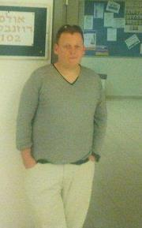
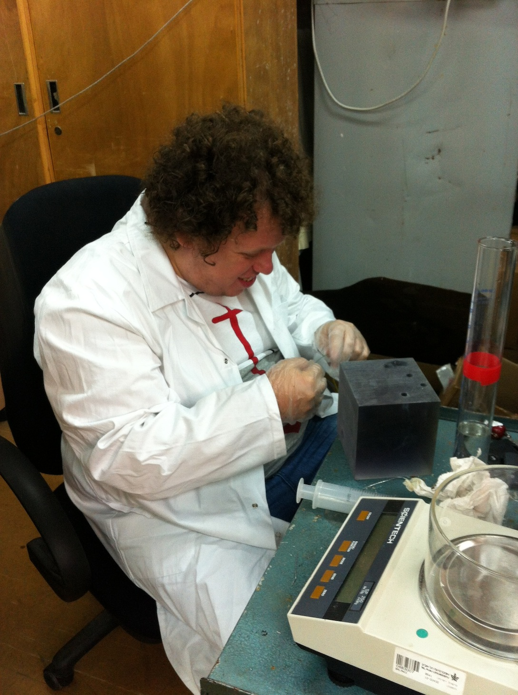
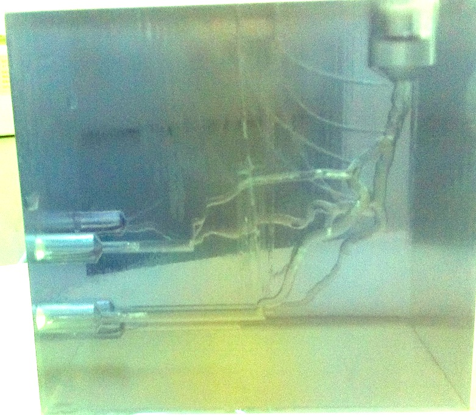

Hadar Biran is working on bio-medical fluid mechanics problem. The project is a collaboration between the TSL, [Dr. Idit Avrahami](http://highlearn.afeka.ac.il/users/www/17672/Dr_Idit_Avrahami.htm) and the Interventional Cardiology Department at the Rabin Medical Center (Beilinson). 

Hadar will use the experimental system constructed by [Dikla Kersh](dikla_kersh.html) and re-constructed by [Katya Barishev](katya_barishev.html) to experiment and develop the novel blood flow measurement technique based on imaging modalities. 

