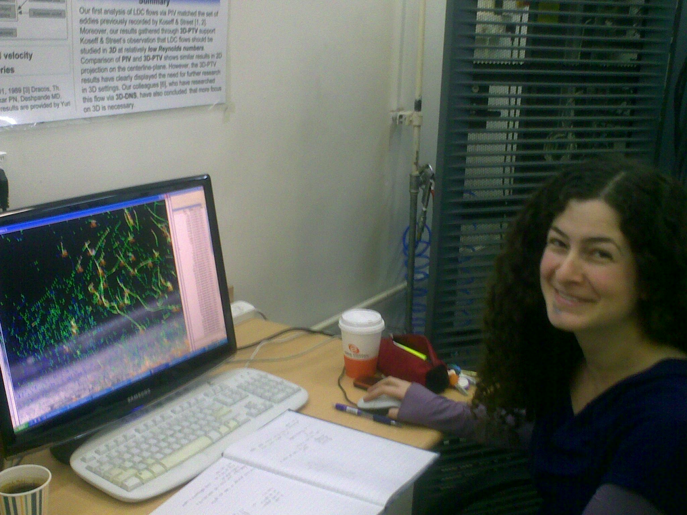
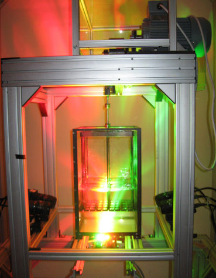

<html>

</html>

Hadar Traugott works on the resuspension of solid particles in turbulent environment. Turbulent flow picks up the solid particles lying on the bottom with and without mean flow (or mean shear). This aspect is not known as good as the resuspension in fixed or moving beds of flowing channels. The question whether different mechanisms of resuspension are observable experimentally. 

### CV

Hadar's resume is available from this link: [Hadar_Traugott_CV.pdf](https://dl.dropbox.com/u/5266698/hadar_traugott_CV.pdf)

### Publications

Hadar Traugott has won the first prize at the [Israel Mechanical Engineering Society 2012 symposium](http://www.icme2012.org.il/) for the outstanding student presentation. The presentation is attached  <http://www.eng.tau.ac.il/~icme2012/all_nf1/ICME_082_Traugott.pdf>. 

Hadar also received the Dean's award for the outstanding achievements during M.Sc. studies. Her work has been presented at:

* ETC 13 conference, see the link to the publication:

> H. Traugott, T. Hayse and A. LIberzon, "Resuspension of particles in an oscillating grid turbulent flow using PIV and 3D-PTV." Journal of physics: Conference Series, volume 318: 052021 (2011). <http://iopscience.iop.org/1742-6596/318/5>

* COST MP0806 Workshop in Leiden on "Particles in turbulence", see the link to the presentation here: <http://www.lorentzcenter.nl/lc/web/2012/488/presentations/Traugott.pdf>

### Preliminary results

Experimental setup - an oscillating grid

<iframe width="420" height="315" src="http://www.youtube.com/embed/etKxG-DiMG8" frameborder="0" allowfullscreen></iframe>

A video clip that shows 4 camera views of the resuspension events.

3D trajectory of a lifted particle from the moment of pick-up and to the full resuspension. 

### Presentation of Hadar's work at St. Anthony Falls Laboratory

<https://speakerdeck.com/alexlib/resuspension-of-spherical-particles-in-the-oscillating-grid-turbulence>
