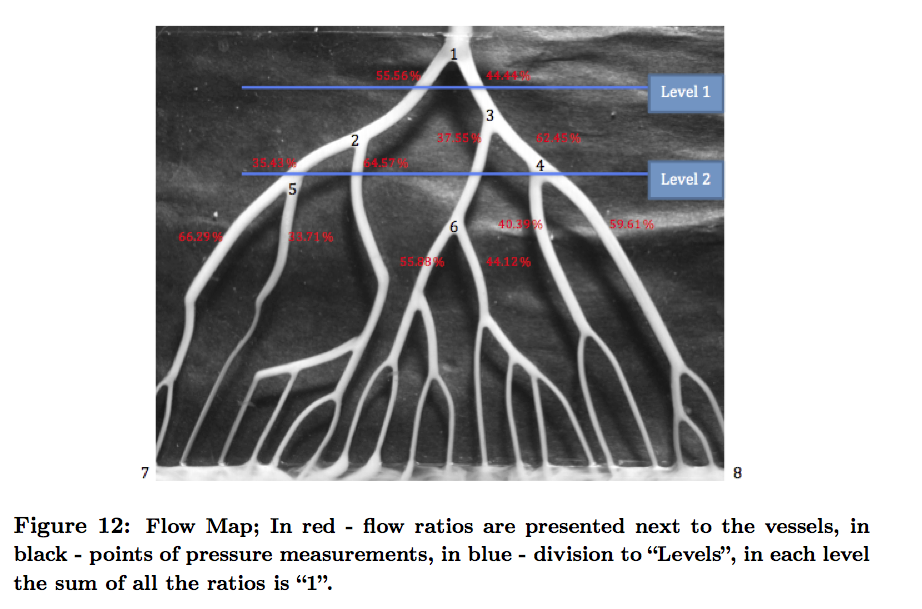

Ekaterina (Katya) Talmor has graduated in 2013 with B.Sc. in Bio-Medical Engineering (Cum Laude). Katya both worked as a research assistant and also completed her final research project with our lab.

### Flow Characterization In Coronary Tree With Stenosis
Download the final report here: [PDF](https://www.box.com/s/j4i8rl3r63eo1lz41cvp) 

It is known that **Coronary Artery Disease** is a leading cause of death worldwide. There are many tools that aid physicians to diagnose the disease. One of them is the measurement of Fractional Flow Reserve (FFR) during the coronary angiography.  Calculating FFR requires an invasive procedure of penetrating the stenosis during the state of maximum hyperemia. The objective of the study is to develop a tool, which with noninvasive flow distribution calculations will determine an FFR value and by that will minimize the risk.

In the course of the work we develop an algorithm, which calculates the blood flow distribution of coronary tree based on image processing of angiography. The algorithm is then tested on images of the flow of contrast agent, which is introduced during angiography. In addition, we build an experimental setup with a model of a coronary artery, (water was a fluid and blue dye as an agent replacement). The algorithm is also applied to an additional experimental setup built around a 3D model of a coronary tree. During the test we obtain full flow and pressure distribution maps among the branches of the coronary tree and compare it to the numerical simulations.

In further study we need to assign the important factors that connect the measurements in models with and without stenosis and compare it with analytical and numerical solutions. This might lead to a tool, which will determine the FFR value based on non-intrusive imaging and image processing calculations.

### Preliminary results
 

 
