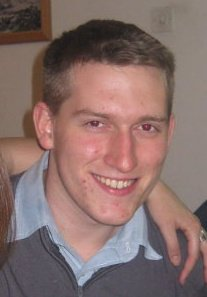

  <koncherr@post.tau.ac.il>

### Short bio

I graduated L.C. Anderson High School in Austin, Texas, with International Bachelorette (IB) Certificate in Physics and Calculus in 2006. A couple months after my graduation (18), I came straight to Israel to fulfill my dream of studying at Tel Aviv University. I studied Hebrew and Exact Sciences for a year in the University Preparatory Program for Olim (Mechinat Olim), and then the following year, got immediately accepted into Mechanical Engineering at Tel Aviv University.

Last Semester (Spring 2012, Aviv 5772) was my final semester. I have completely finished my 187.5 required course hours, and am currently in the final stages of finishing up my Capstone Project. 

My specialization tracks in Mechanical Engineering were:
1. Structures & Computational Mechanics
2. Aeronautics & Space

My capstone project, under the direct supervision of Prof. Alex Liberzon, and with the kind assistance of the faculty engineer, Mr. Eli Kronish, is to build and test a prototype of the University Patent-Pending "Flexible-Blade Viscometer" at the Alex Liberzon Laboratory. This project is my final achievement for my Bachelor's degree.

### Flexible blade viscometer (patent-pending technology)

The Flexible Blade Viscometer is a new type of rotational viscometer. Most rotational viscometers are based on measuring the torque/power that is required to resist the viscosity of the fluid. Verily, these viscometers do work, but are not necessarily sensitive enough to detect, for instance: a small change in viscosity due to a minute change in the concentration of dilute polymer solution.

This patent idea started out as just a simple modification to the standard overhead stirrer. One replaces the rigid stirring impeller with flexible blades, with strain gauges attached. The blades rotating in the fluid will bend in accordance to the viscosity of the fluid, i.e. a more viscous fluid will cause the blades to bend more. As well, the faster the blades turn, the more they will bend. Therefore, the measurement of the strain gauges and rpm should be enough to measure the viscosity of the fluid.

There have been three experiments performed on this Patent. The first was done by Roman Povolotsky, the second by Avi Friedman, and the third was by Me, Avi, and Tal Hadad. In parallel, Shlomo Markman is working on the Computational Fluid Dynamics Analysis.

The first part of my project was to study/research those three experiments, and do theoretical & dimensional analysis on the Viscometer. The second part of my project was to pick and design a prototype. The third and last part, which is on the horizon, is to build the prototype, calibrate it, and show the feasibility of the patent for Newtonian Fluids.
