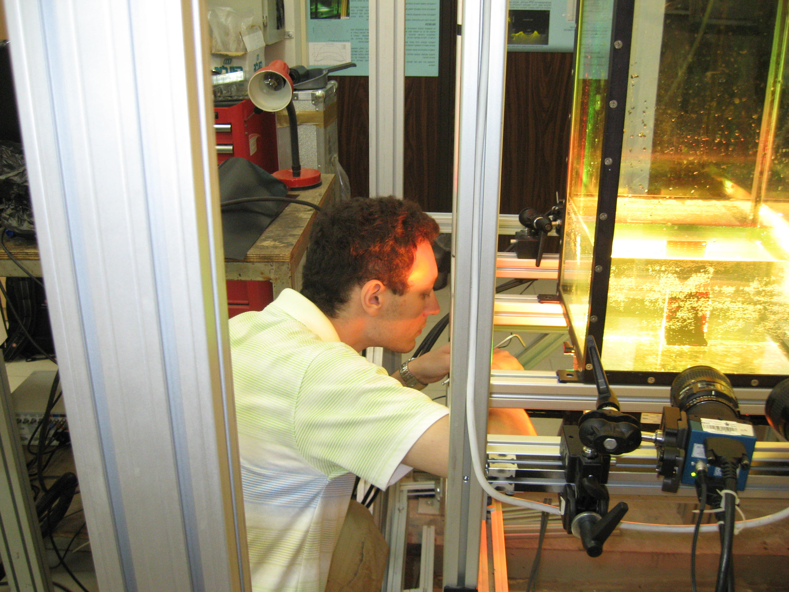
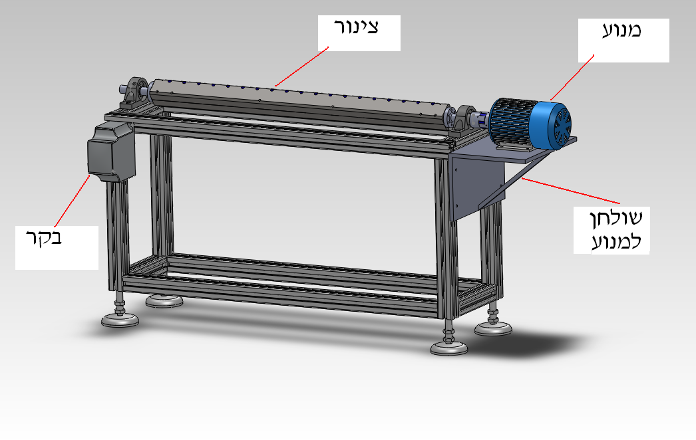

<html>

</html>

Mark Baevsky was our undergraduate student working together with [Hadar Traugott](hadar_traugott.html) on the project "Resuspension of particles in turbulent flows" and also working on the final project in Mechanical Engineering on the design and production of the "Soft silicon pipe apparatus". 

Starting from October 2012, Mark started his M.Sc. thesis research. The topic will be related to the pulsating and unsteady flows in compliant tubes (see his final project) with variable thickness and compliance. 

Read the full report (Hebrew) 

[Final_report.pdf](https://www.box.com/s/e991ab0a3ddb3b42a127) 

The final configuration of the Compliant pipe production apparatus looks like: 

#### See the video clip of the apparatus in action: 

<https://plus.google.com/114646012645957748689/posts/E3o3Tc5G6XV>
