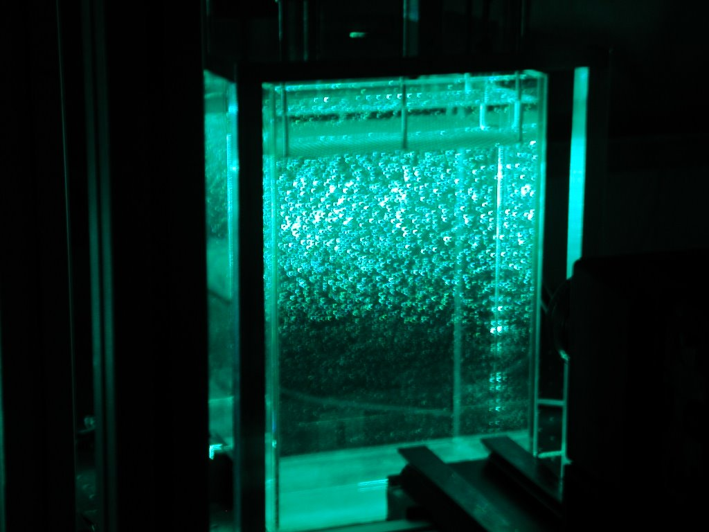
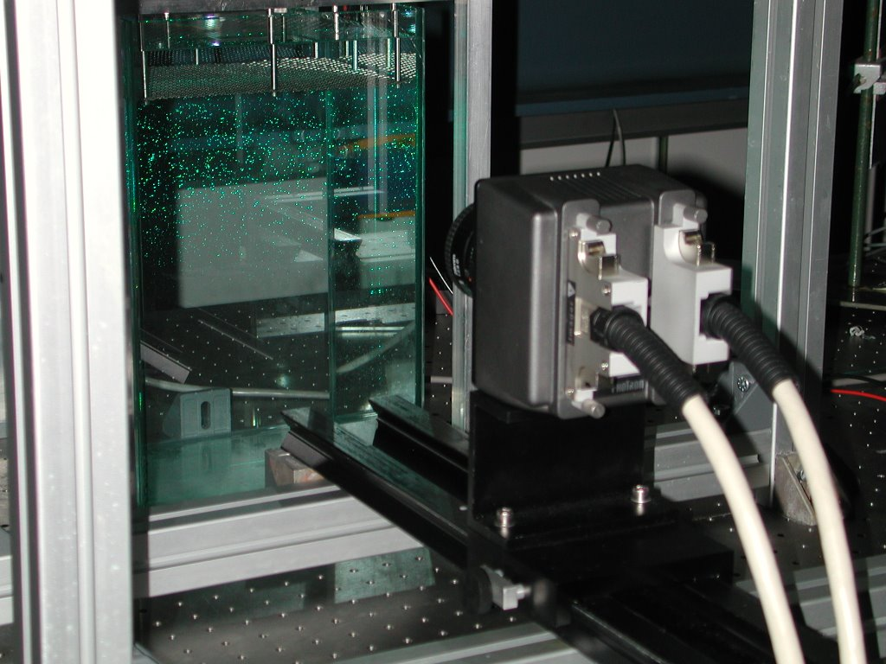

Michael worked on his final project with the lab, working on the design and construction the oscillating grid facility. 

### Prototype, working in the Alex Liberzon Laboratory

Compare it to the previous design: 

