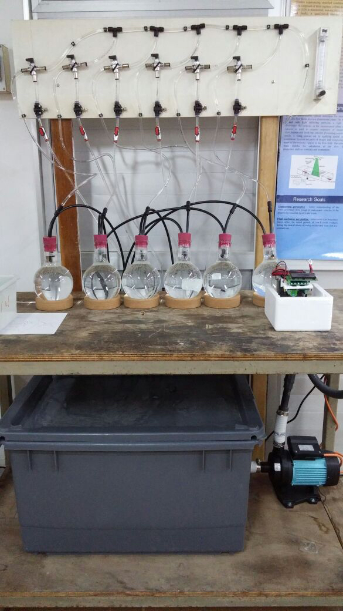

<html>

</html>

Oz Habiby starts his M.Sc. research thesis under the guidance of Dr. Alexander Golberg from the 
Porter School of Environmental Studies and our laboratory. The research topic will be **an intensive cultivation of macroalgae
for efficient biofuel energy production**

