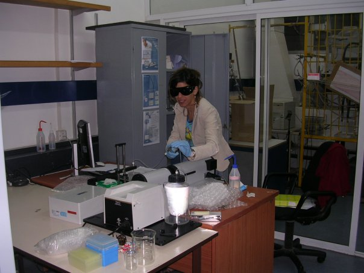

 
E-mail: <reut101@gmail.com>

Reut has graduated from the School of Mechanical Engineering in 2006 and joined the laboratory as our first Master student. Reut was responsible for the lid-driven cavity experimental setup and the three-dimensional particle tracking velocimetry measurement technique. During the studies she visited the Monash University (Melbourne, Australia) and worked in the group of [Prof. Julio Soria](http://users.monash.edu.au/~soria/) on the two-dimensional turbulent flow research using particle image velocimetry (PIV). 

### Research

[Lid driven cavity - aspects of two-dimensional as compared to the three-dimensional flows](../research/cavity.html)
