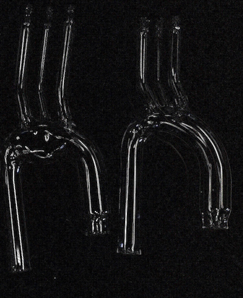

Shirly Steinlauf is the M.Sc. student, supervised jointly with Prof. Idit Avrahami from Ariel University. Shirly is working on the experimental research of the flow in aorta. Some of her models are shown below. Stay tuned for the PIV results. 

