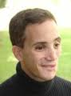

## Contact details: 

<html>

</html>

Yosef Meller  
Ph.D student   
Desk/Lab: +972-3-6406860   
Fax: +972-3-6406860   
E-mail: <yosefmel@post.tau.ac.il>  

 
### Ph.D research 

**Particle resuspension in turbulent flows** 

### Education

#### M.Sc. Mechanical Engineering, Tel Aviv University

Thesis: ** Packed, doubly-connected CPV/T fields **

#### Publications:

Meller Y. and Kribus A., Kaleidoscope homogenizers sensitivity to shading <http://www.sciencedirect.com/science/article/pii/S0038092X1200401X>, Solar Energy, 88:204-14, 2013

Meller, Y. Analytically calculating shading in regular arrays of sun-pointing collectors <http://www.sciencedirect.com/science/article/pii/S0038092X10002653>, Solar Energy, 84:1967-74, 2010

  

