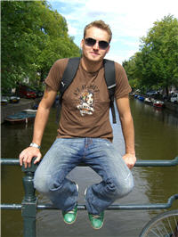
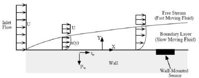
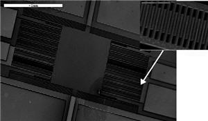

## Contact details: 

<html>

Youry Borisenkov 
Ph.D student  
Desk/Lab: +972-3-6405261  
Fax: +972-3-6407334  
Cell: +972-52-3836163  
Home: +972-77-7961395  
youry.bo@gmail.com  
</html>

### Ph.D Research Theme

[MEMS-based micro flow sensor](../research/microsensor.html)

### Education

#### M.Sc, Mechanical Engineering, Tel Aviv University [2005-2008]

**Micro-machined Shear Stress Sensor** 

 

Origin of Wall Shear-Stress (Padmanabhan et al,1997 ) 

Some Pictures of the Sensor: 

 

 

 [*Thesis Abstract*](../files/Abstract.doc) 

### B.Sc  (Mech. eng) - Tel Aviv University [2002-2006]   
  

