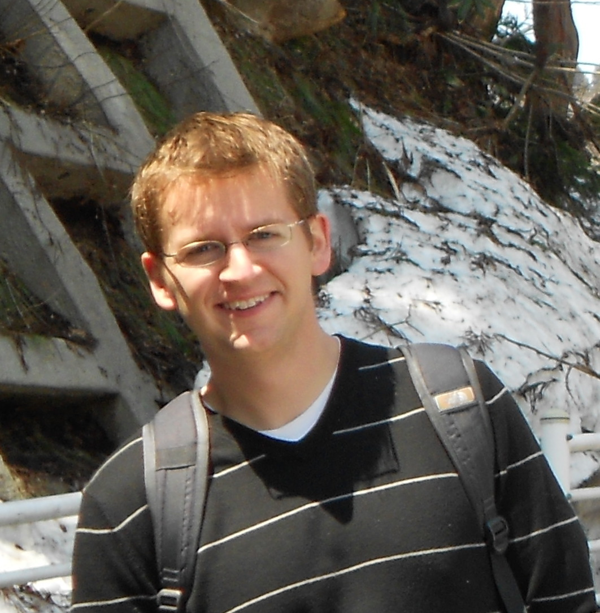

## Short bio

<html>

</html>

I completed my PhD at the University of Western Ontario in the field of Civil and Environmental Engineering. Currently, I am an Azrieli International Post-doctoral Fellow at Tel Aviv University in the field of environmental fluid mechanics.  Within this field my particular focus is on the decay of turbulent patches in stable stratification.  

Stable density stratification (i.e., density increasing with depth) is a characteristic feature of the world’s oceans.  Based on observations of the ocean it is possible to estimate how much energy is required to maintain the observed stratification.  While tides and surface generated turbulence account for some of the required energy, there are still open questions about what accounts for the gap between known energy sources and the amount of energy required.  One of the most widely held hypotheses is that there are high intensity “patches” of turbulence caused, for example, by breaking internal waves that provide the missing energy.  These patches are relatively small compared to the scale of the ocean making it a challenge to model their role at a global scale.

The goal of my research is to study the dynamics of localized patches of high-intensity turbulence in stable stratification.  These tests are carried out in a laboratory setting enabling the use of two- and three-dimensional velocity measurement techniques (for exapmle see the figure below).  The experimental work is being performed in collaboration with researchers at Ben-Gurion University while numerical simulations are being performed at Cornell University.  It is hoped that better understanding of the dynamics of these high-intensity turbulence patches will lead to improved global ocean circulation models.

## Education

* B.E.Sc., Mechanical Engineering (2002-2006)  
University of Western Ontario  
    
* Ph.D., Civil and Environmental Engineering (2006-2011) 
University of Western Ontario  
    

## Current research interests

* Environmental fluid mechanics - Evolution of secondary turbulence events in stratified fluids  
    
* Bluff body aerodynamics - Vortex shedding from elongated bluff bodies (for example, long-span suspension bridges)  
    
* Improvement and development of fluid measurement devices - Current project: <http://www.openpiv.net>  

### Recent experimental result

Using V3V system (TSI Inc.) we obtained the 3D flow characteristics in weakly stratified flow around the stratified patch

    

You can also visit my personal website: <http://www.zacharyjtaylor.com>
