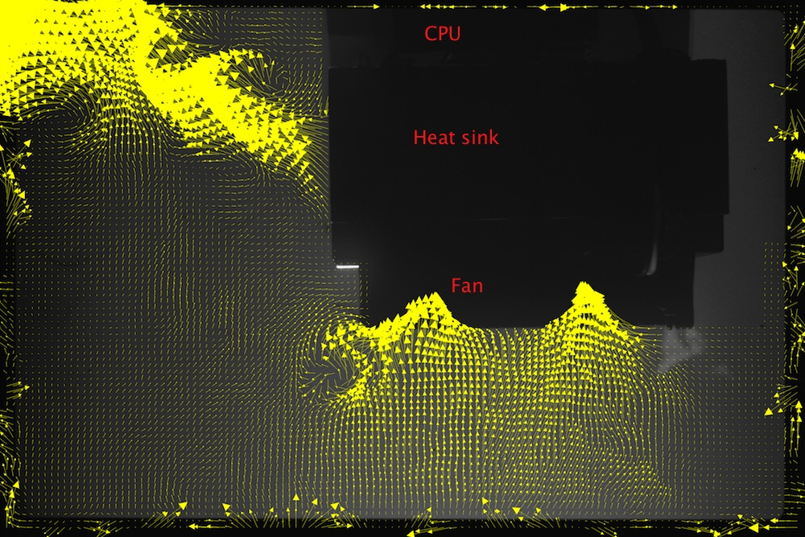

<html>

</html>

### M.Sc. thesis of [David Altura](../people/david_altura.html)

This research shows that we can **improve** the fan-heat-sink cooling system performance in two aspects: 

1. Increasing convective heat transfer and,
2. Maximizing the coefficient of performance (COP) by applying an unsteady but controlled fan operation. 

The presentation gives some highlights of this research: [PDF](../files/davidaltura.pdf)

<html>

</html>

### Final year project of [Maya Beckerman](../people/maya_beckerman.html)

Cooling of PC using unsteady convective heat transfer 

We have transparent PC case with installed air flow ventilation, see the images: 

       

The project is experimental: 

*   Make the air cooling system working with an external controller that enables to turn on/off any combination of the air flow ventilators 
*   Make flow visualization with smoke or aerosols 
*   Measure the flow in the case 
*   Analyse and propose for an optimal configuration of air fans. 

New slideshow: 

 

Maya's poster [PDF](../files/poster.pdf)
