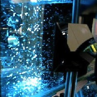
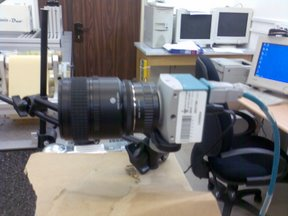
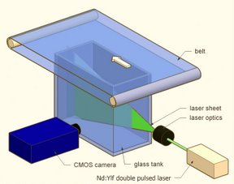
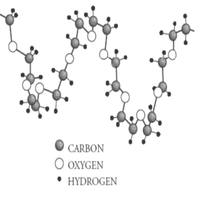
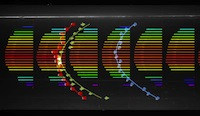

The main research interests are <strong>turbulent flows</strong> in natural and industrial applications. Our speciality is in accurate <em>measurements of velocity derivatives in Eulerian and Lagrangian settings</em>, using either multi-hot-wire or <strong>3D particle tracking velocimetry (3D-PTV) </strong> technology. We also implement our methods to unsteady flows (pulsating, periodic, etc.) of air and liquids in cooling applications, micro-electronics industry applications (coating, etching, etc.), bio-medical applications and resuspension of particulate materials from smooth and rough walls. 

Some examples are given below: 

### Particles in turbulence

 

	We study several aspects of particle-laden turbulent flows: a) clustering, b) resuspension (detachment from the wall), c) impact or deposition on the walls, etc. In those studies we try to develop the new approach, based on the direct force estimates from the two-phase 3D-PTV data, i.e. combining the motion of particles with the flow velocity fields obtained by the flow tracers motion. 

 <a href="two_phase.html"> <button type="button" class="btn btn-info btn-sm">More ...</button></a>

### Real time image processing for 3D-PTV

 

	Three dimensional Particle Tracking Velocimetry (3D-PTV) is our main measurement method. We can measure 3D turbulent flows and even two-phase flows or interactions of objects (particles, bubbles, droplets, animals, etc.) with the turbuelnt flow. The tracking procedure requrires digital video recording and therefore the hardware limitations are mostly due to the large data bandwidth. We develop the image processing algorithms, software and hardware to resolve this bottleneck - introducing the real-time image processing into the pipeline. 

 <a href="realtime.html"> <button type="button" class="btn btn-info btn-sm">More ...</button></a>

### Lid driven cavity

 

	Lid driven cavity (LDC) is one of the kernel cases in stability analysis. This is a great example of the flow in which the flow is stable at low Reynolds numbers and it is relatively easy to follow the evolution of the flow through a set of bifurcations until the transition to turbulence. We use the LDC flow in studies of particle resuspension under shear, mixing, instability and few practical applications. 

 <a href="cavity.html"> <button type="button" class="btn btn-info btn-sm">More ...</button></a>

### Dilute polymers effects on turbulence

	Dilute polymers are known to affect turbulent flows and the most known example is the drag reduction in oil pipelines. We study the less known part of their effect, the mechanism by which turbulent kinetic energy transfer from large to small (and maybe vice versa) is affected by dilute polymers. The main facility is an oscillating grid and the research is in collaboration with the partners from Germany and Italy. 

 <a href="polymers.html"> <button type="button" class="btn btn-info btn-sm">More ...</button></a>

### Electronics air cooling using unsteady flows

 

An idea to use the unsteadiness of the flow in order to increase the heat transfer coefficient and thus improve the heat transfer rates is not new. We took this idea into the system which is typically poorly designed - the flat heat sink with the air fan cooling. This system is highly inefficient due to the stagnation zones inside the heat sink channels. Our method is improving the heat transfer efficiency of such systems by re-using the natural convection and better flow and heat transfer control. 

 <a href="cooling.html"> <button type="button" class="btn btn-info btn-sm">More ...</button></a>

### Pulsating flows

One of the central topics of our research is the complex, pulsating flows in three-dimensional and compliant enclosures. These flows are at the core of the biomedical applications such as aorta flow, mitral valves, stent designs, etc. We can provide a better view on the motion of the particulate or dissolved matter in such flows due to the three-dimensional partcile tracking velocimetry capabilities. We measure particle residence time, resistances of flexible complex geometries and wall shear stresses. 

 <a href="pulsating.html"> <button type="button" class="btn btn-info btn-sm">More ...</button></a>

#### [Past research projects](past_research.html)

#### [Patents](patents.html)

