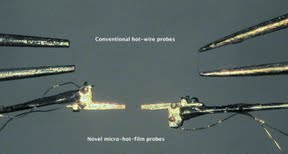

## Present research projects

(see below the link to the past research projects and to the patents)

The main research topics are turbulent flows in natural and industrial applications. Moreover, our speciality is in accurate measurements of velocity derivatives in Eulerian and Lagrangian settings, using either multi-hot-wire or 3D particle tracking technology. We also implement our methods to unsteady flows (pulsating, periodic, etc.) of air and liquids in cooling applications, micro-electronics industry applications (coating, etching, etc.), bio-medical applications and resuspension of particulate materials from smooth and rough walls. 

Few examples are given below: 

[Multi hot-wire](multihotwire.html) | [Pulsating flows](pulsating.html) 
------------ | ------------- 
 |   
[MEMS sensor](microsensor.html) | [Particles in turbulence](twophase.html)
 | 
[Lid driven cavity](cavity.html) | [Real time 3D-PTV](realtime.html)
 | 
[Polymers in turbulence](polymers.html) | [PC air cooling by unsteady flows](cooling.html)
	 |  

#### [Past research projects](past_research.html)

#### [Patents](patents.html)

