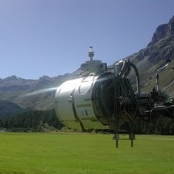
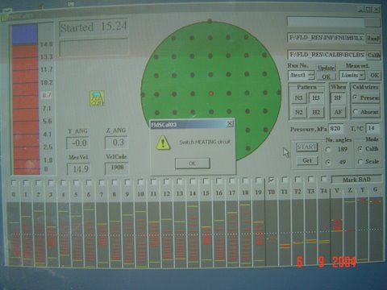
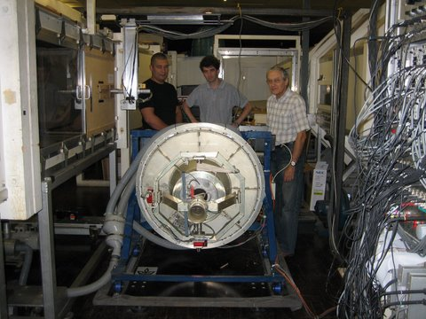
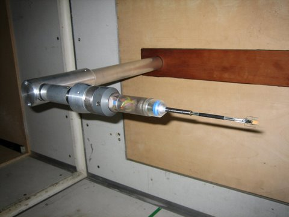

 

 

#### History
From Prof. Tsinober web page: <http://www.eng.tau.ac.il/~tsinober/other.html>

> A long-standing and fruitful collaboration with people from ETH Zürich started during my sabbatical in 1988. There I developed and manufactured myself a multi-hot-wire probe allowing access to the full tensor of velocity derivatives. Generous technical support and equipment from Swiss colleagues helped to utilize the probe in a turbulent flow past a grid at relatively low Reynolds number (Rel ~100, Tsinober et al., 1992). After several attempts to get access to higher Reynolds numbers we were first to succeed to make a good experiment at Rel~104 in the field research expedition in Israel (described in our Physics of Fluids paper, Kholmyansky et al., 2001b). We were lucky to renew our Swiss collaboration and performed an outstanding experiment in an exceptionally favorable (not only scientific-wise) environment in 2003 and 2004. The outcome of the two field research expeditions is described in the set of three papers in JFM (Gulitski et al., 2007a–c). By that time we also made a number of essential qualitative improvements and modifications of our multi-hot-cold-wire experimental method. These made possible performing measurements without employing the Taylor hypothesis, thus enabling access to fluid-particle acceleration, and simultaneous measurements of the full vector of the temperature gradient. The robustness of our system and the feasibility of in-flight experiments for measuring turbulent parameters of atmospheric turbulence, important for meteorological purposes and atmospheric boundary layer modeling, was demonstrated during our airborne research expedition in 2000 (Busen et al., 2001).

#### Calibration unit control software: snapshots

   

#### The team behind the calibration "barrel"

#### Calibration unit in the lab

#### Probe in action in the wind tunnel at the Imperial College, London.

#### Zoom view of the probe and its schematics

#### Publications
* Tsinober, A. (2009) ***An informal conceptual introduction to turbulence***, Springer, 483 pp.
* Gulitski, G., Kholmyansky, M., Kinzelbach, W., Lüthi, B., Tsinober, A. and Yorish, S. (2007a) Velocity and temperature derivatives in high-Reynolds-number turbulent flows in the atmospheric surface layer. Part 1. Facilities, methods and some general results, J. Fluid Mech., 589, 57–81.
* Gulitski, G., Kholmyansky, M., Kinzelbach, W., Lüthi, B., Tsinober, A. and Yorish, S. (2007b) Velocity and temperature derivatives in high-Reynolds-number turbulent flows in the atmospheric surface layer. Part 2. Accelerations and related matters, J. Fluid Mech., 589, 83–102.
* Gulitski, G., Kholmyansky, M., Kinzelbach, W., Lüthi, B., Tsinober, A. and Yorish, S. (2007c) Velocity and temperature derivatives in high-Reynolds-number turbulent flows in the atmospheric surface layer. Part 3. Temperature and joint statistics of temperature and velocity derivatives, J. Fluid Mech., 589, 103–123.

#### [Software](software.html)

[LUT based calibration of the multi-hot-wire anemometer (beta version)](hot_wire_calibration.html)

