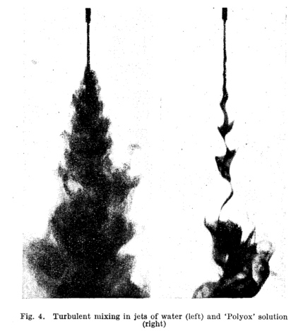

See also our work on [Surfactants](surfactants.html)

This the research project that started during the postdoctoral period at the ETH Zurich. The work is performed in close cooperation with the Swiss group of Dr. Michele Guala, Dr. Beat Luethi, Prof. Wolfgang Kinzelbach and with the direct connection to Prof. Arkady Tsinober. Later we had Dr. Markus Holzner joining our efforts. The results are published in Physics of Fluids in 2005, 2006 and 2009 papers and in numerous conferences and meetings. 

### The most interesting question is "how"?

How the minute amount of relatively small polymer molecules (although long, but short as compared to the Kolmogorov small scales of turbulence) can make such an enormous effect:

  
From: Gadd, G.E. "Turbulence damping and drag reduction produced by certain additives in water", Nature, 1965

### Goals

1.  The main goal was (it still is) a comparative study of the small scale properties of a quasi-isotropic turbulence in a Newtonian fluid (water) and in dilute polymer solution (up to 100 wppm) 
2.  The research is done primarily by using three-dimensional particle tracking velocimetry (3D-PTV) system, allowing to measure the velocity field, the field of velocity derivatives in time and in a Lagrangian manner. 
3.  The expectation is to identify the influence of polymers on the fields of strain, vorticity, dissipation, enstrophy and their production in turbulent flows. 

### Experimental setup 

The quasi-isotropic and homogeneous flow is produced by 8 counter-rotating disks on two opposite walls of the following apparatus. The scheme on the right shows the direction of rotation of 4 disks on one wall, in so-called ìfour-millî configuration. 

The apparatus and the scheme of the quasi-isotropic turbulent flow forcing. 

The flow is seeded with 30 micron polystyrene particles and it is illuminated by 20 Watt CW Ar-Ion laser. 

Observation volume 

The observation volume is of 10 x 10 x 10 mm and it the tracer motion is recorded with 4 CCD cameras: 

### Poster

## TKE production in dilute polymer solutions

**Conference on Turbulence and Interactions TI 2006,29 May-2 June 2006, Porquerolles , France** 

### Abstract 

Drag reduction is the most widely known effect of the dilute polymers on turbulent flows, discovered by Toms [12] . The bibliography of Nadolink and Haigh [10] , for example, lists more than 2500 entries, the main aspects of the phenomenon were reviewed in [4] and [9] , and more recent studies are listed in [2,6,11,14], among many others. This phenomenon is observed on the large scales (i.e. velocity scales), yet there is a consensus that dilute polymers act mainly on the small scales (i.e. scales of velocity derivatives) (see for example, [3,5,13]). It has been shown in [1], for example, and in our recent study in [7], among others, that drag reduction is only one aspect of an interaction of polymers with the turbulent fields of velocities and velocity derivatives, and turbulent flows are altered in the presence of dilute polymers, even if no drag reduction occurs. Hence, we devote our investigation to study such an interaction of turbulent flow with dilute polymers in a simple turbulent flow with small mean velocity gradients, and far from boundaries. We focus on the aspects related to the turbulent kinetic energy (TKE) production, (where is the Reynolds stresses, and is the mean rate of strain tensor), such as anisotropy of Reynolds stresses, the orientation of the velocity vector field in respect to , and others. We present an experimental, comparative study of the turbulent quantities of a weak mean turbulent flow in a Newtonian fluid and in a dilute polymer solution with an emphasis on phenomena at scales of velocity derivatives and velocity fluctuations. The experiment performed by using a three-dimensional particle tracking velocimetry (3D-PTV) system [8]. 3D-PTV allows following in a Lagrangian manner and measuring the field of velocity and full tensor of velocity derivatives along trajectories of fluid tracers. Properties of the weak mean flow, of fluctuating velocity, and the small-scale quantities such as vorticity, strain and their production terms, are studied by using the interpolation of Lagrangian information onto the Eulerian grid. The comparison of experimental data of the water and dilute polymer solution flows provides a direct observation of the influence of polymers on the TKE production, and the associated properties of the turbulent flow. 

### Results 

Probability density function (PDF) of TKE production of water (full symbols) and dilute polymer solution (open symbols) flows. Numbers in legends correspond to the integral of TKE production over the observational volume for the respective flow case. 

PDF of cosine of the angle between the tensor of Reynolds stresses and the mean rate of strain tensor (equivalent to the normalized TKE production) of water (full symbols) and dilute polymer solution (open symbols) flows. 

Scatter plots of the invariants (II,III) of the anisotropy tensor of vorticity of the water flow (a) and dilute polymer solution flow (b). The lines denote the envelope of the anisotropy invariant map. 

BIBLIOGRAPHY 

[1] Cadot O., Bonn D., and Douady S. ìTurbulent drag reduction in a closed flow system: boundary layer versus bulk effects,ì Phys. Fluids, Vol. 10, pp. 426, 1998. 

[2] Dubief Y. White C. Terrapon V.E. Sheqfeh, E.S.G. Moin, P. and Lele, S.K., ìOn the coherent drag-reducing and turbulence-enhancing behavior of polymers in wall flowsì, J. Fluid Mech. Vol. 514, pp. 271, 2004. 

[3] Gyr A. (ed.) Structure of turbulence and drag reduction , Springer, 1990. 

[4] Gyr A. and Bewersdorff H.-W. Drag reduction of turbulent flows by additives , Kluwer, 1995. 

[5] Gyr A. and Tsinober A. On some local aspects of turbulent drag reducing flows of dilute polymers and surfactants,ì Advances in Turbulence, Vol. 6, pp. 449, 1996. 

[6] Gupta V.K. Sureshkumar R. and Khomami B. ìPolymer chain dynamics in Newtonian and viscoelastic turbulent channel flows,ì Phys. Fluids , Vol. 16, pp.1546, 2004. 

[7] Liberzon A., Guala, M., Luthi B., Kinzelbach W. and Tsinober A. ìTurbulence in dilute polymer solutions, Phys. Fluids, Vol. 17, 031707, 2005. 

[8] Luthi, B. Tsinober, A., Kinzelbach, W. Lagrangian measurement of vorticity dynamics in turbulent flow,ì J. Fluid Mech, Vol. 528, pp. 87, 2005. 

[9] McComb, W.W. The physics of fluid turbulence , Clarendon Press, Oxford, 1990. 

[10] Nadolink, R.H. and Haigh, W.W., ìBibliography on skin friction reduction with polymers and other boundary-layer additives,ì ASME Appl. Mech. Rev. Vol. 48, 351, 1995. 

[11] Ptasinski P.K. Boersma B.J., Hulsen M.A., Nieuwstadt F.T.M. Van Den Brule B.H.A.A. and Hunt J.C.R. ìTurbulent channel flow near maximum drag reduction: simulations, experiments and mechanisms,ì J. Fluid Mech. , Vol. 490 , 251, 2003. 

[12] Toms B.A. ìSome observations on the flow of linear polymer solutions through straight tubes at large Reynolds numbers,ì Proc. of the 1st International Congress on Rheology, Vol. II, 135, North-Holland, Amsterdam, 1949. 

[13] Tsinober A., ìTurbulent drag reduction versus structure of turbulence, In Gyr, A., editor, Structure of Turbulence and Drag Reduction , Springer, pp. 313, 1990. 

[14] Warholic M. D., Gavin M. S. and Hanratty T. J. ìThe influence of a drag-reducing surfactant on a turbulent velocity field, J. Fluid Mech., Vol. 388, pp. 1, 1999.
