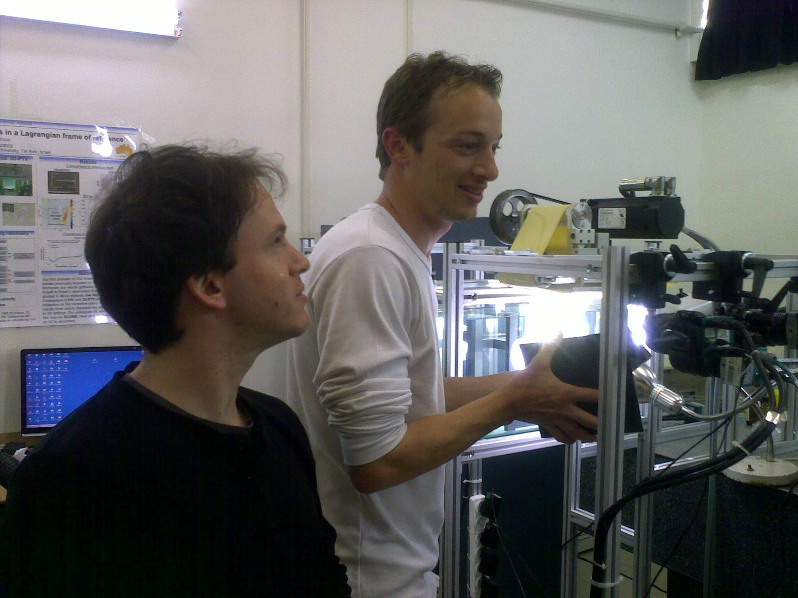
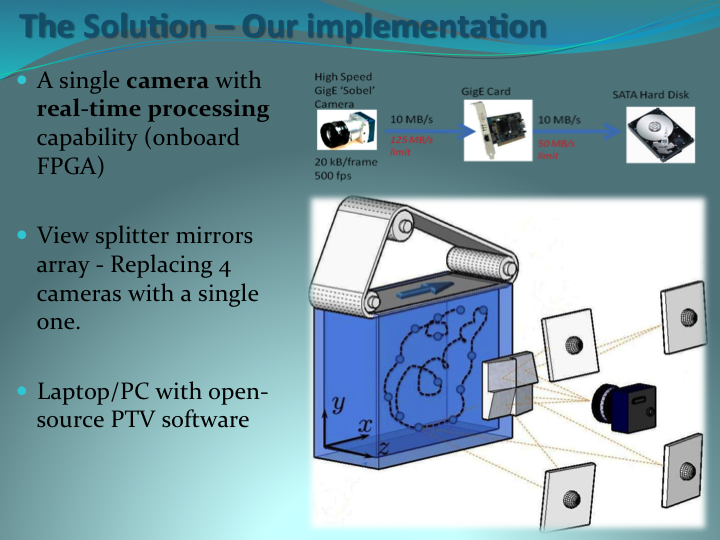

### The bottleneck problem

The bottleneck of the high speed tracking systems today is the data transfer. Our real time image processing solution on FPGA is removing this constraint. One can achieve a single-camera-with-FPGA solution for the 3D Particle Tracking at very moderate budget. No synchronization, no data transfer limits, no framegrabbers, no image processing in software. Record and track in Matlab/Python or our 3D-PTV software. 

<html>
 
</html>

Mark and Eldad adjusting the mirrors

[Manual of the MC1324 camera](manual_mc1324.html)

### The results

<html>

</html>

We have completed the first round of experiments in the lid driven cavity facility. The 2D Sobel-based PTV system worked in parallel to the regular 3D-PTV system and the results were compared in the mid-plane of the cavity. 

The results appear to be very interesting, beyond the real time image processing story and summarized in the manuscript which is published in the Experiments in Fluids journal [Publications](../publications.html)

Read a short summary: [PDF](../files/Abstract.pdf)

Slideshow: [PDF](../files/mark_seminar.pdf)

