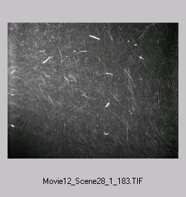
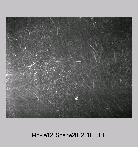
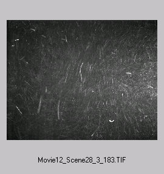
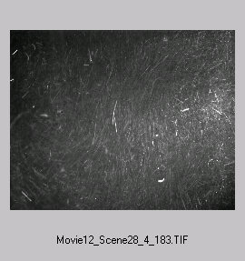

#### Tracking software graphical interface - help scientists to experiment

#### Automatic calibration using laser pointer - solve a long-standing problem

  

#### Experimental data analysis - "looking for the hidden beauty of the flow"

#### Streaks Tracking Velocimetry 

 

More info of the project page: [Streaks Velocimetry](research/streaks)

#### Air-flow for PC cooling - measurements and *closed-loop control*

We have transparent PC case with installed air flow ventilation, see the images:

The project is not only experimental, some numerical codes are needed:
* Make the air cooling system working with an external controller that enables to turn on/off any combination of the air flow ventilators
* Make flow visualization with smoke or aerosols
* Measure the flow in the case
* Analyse and propose for an optimal configuration of air fans. 

#### Open source software for Particle Image Velocimetry - http://www.openpiv.net

**Open for undergraduate students**

#### Bees - how do they smell it? 

Adding a source of smell and the air flow that models their natural environment, we are interested to see whether bees approaching the smell source is different under different flow conditions. **Open for undergraduate students**

